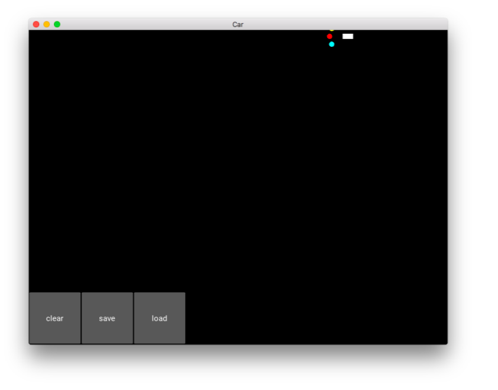
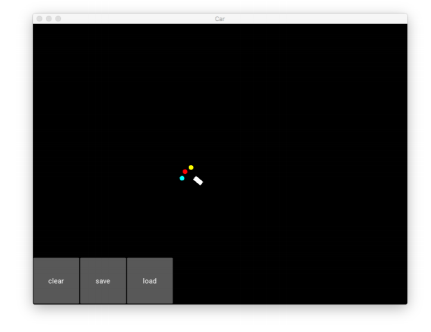
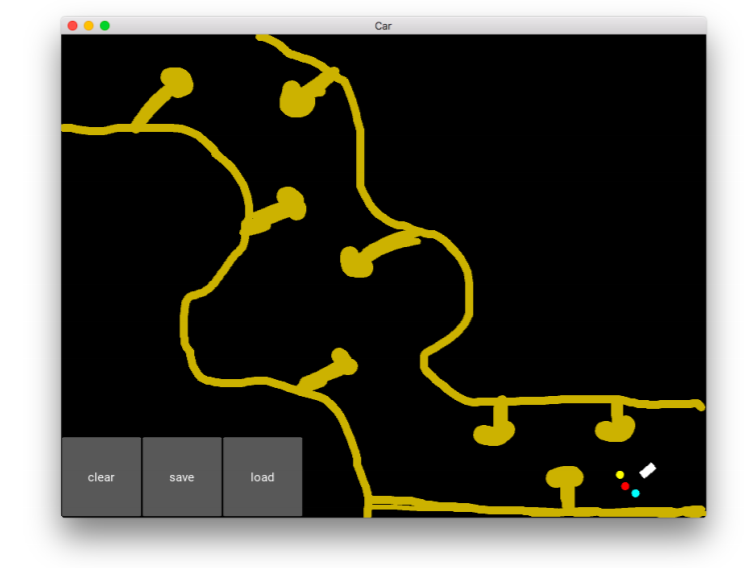

# Self-Driving-Car-Simulation
This repository contains the completely explained code in python for Self Driving Car Simulation using certain tools and libraries like Anaconda , Pytorch , Kivy. This code is not a self-written but learnt from Online Course regarding Artificial Intelligence.

# Output: 

 

